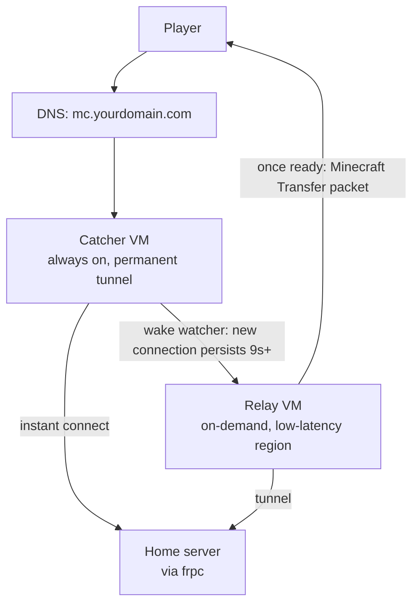

# mc-serverless-proxy

A reference architecture for exposing a self-hosted Minecraft server publicly, with a
low-latency regional relay that wakes on demand and costs close to $0/month when idle.
Built and battle-tested on a real home server behind CGNAT, running on Google Cloud.

## "Serverless"? Not really, it cheats

Nothing here runs on an actual serverless platform. There's no Cloud Run, no Lambda,
no managed autoscaler. Every component is a bog-standard VM with a persistent disk,
the same kind of instance you'd use for anything else. What this repo actually does is
fake the two things that make serverless economics work, using nothing but plain VMs,
a couple of polling loops, and one specific GCP billing exemption:

1. **Scale-to-zero, faked with a stopwatch.** A real serverless platform scales to
   zero and back natively, the provider owns that logic. Here, `relay/idle_shutdown.ts`
   just polls `ss -tn` every 20 seconds and calls `poweroff` once nothing's been
   connected for 5 minutes, and `catcher/catcher_wake_watcher.ts` polls the same way to
   decide when to call the Compute API and boot it back up. It's a cron job pretending
   to be a serverless runtime, and it works because there's exactly one predictable
   thing being scaled (one game server's connection state), not because there's any
   real infrastructure underneath doing it for you.
2. **A free static IP, faked with a load balancer.** GCP doesn't actually offer a free
   external IP for an always-on VM (see below, it bills ~$3.65/month even on a
   free-tier instance). The $0 catcher IP in this setup isn't free because GCP made it
   free, it's free because a static IP attached to a *load balancer forwarding rule* is
   billed differently than one attached to a VM's own network interface, and nothing
   requires the backend behind that forwarding rule to be doing anything
   load-balancer-shaped. One VM, one rule, same address, different billing category.

Both tricks are legitimate, documented GCP behavior, not exploits, but they're exactly
that: tricks. The honest description of this project is "ordinary VMs, DIY'd into
looking like a serverless bill," not "serverless infrastructure." If you want the real
thing, a managed platform will genuinely scale to zero for you; you'll generally pay
more for the privilege on a workload this small and predictable.

## The problem this solves

You're self-hosting Minecraft at home. You want:

- A stable public address that's always reachable, so DNS never has to change and
  players never get "unknown host."
- Low latency for a specific region far from your home connection, without paying for
  a VM to sit there 24/7 doing nothing most of the day.
- No noticeable interruption when the low-latency path has to spin up.

This repo is the setup that does that, plus the exact GCP cost mechanics that get the
idle cost down to essentially nothing.

## Architecture



- **Catcher**: a small always-on VM in a free-tier-eligible region. Runs `frps`, holds
  a permanent tunnel straight to your home server, and is the one thing that's always
  reachable. Also watches for new connections and wakes the relay when one looks real.
- **Relay**: a VM in whatever region you actually want low latency for. Stopped by
  default. Boots on demand, points DNS at itself, tunnels to your home server the same
  way catcher does, and shuts itself back down (flipping DNS back to catcher first)
  within 5 minutes of the last player disconnecting.
- **Home server**: your actual Minecraft server. Watches its own join log, and once the
  relay is confirmed reachable (a real Minecraft protocol handshake, not just a TCP
  connect), uses [XferHelper](https://github.com/mliem2k/XferHelper) (included here as
  a submodule) to send connected players over via the vanilla Transfer packet, no
  reconnect-by-hand required.

The result: a player always connects instantly through catcher. If the relay isn't
already warm, they get one automatic, brief reconnect a bit later once it is, same as
any other server-side transfer.

## Why the relay wakes on demand instead of running 24/7 (cheat #1)

Running a second region's VM around the clock is the obvious approach and the wrong
one for a low-traffic personal server: you're paying full-time compute for a resource
used a few hours a week. `catcher/catcher_wake_watcher.ts` watches for a connection
that persists 9+ seconds (long enough to rule out a status ping or health check, short
enough that players don't notice) and wakes the relay through GCP's Compute API,
authenticated via the VM's own metadata-server service account token, no static
credentials involved.

## Getting the idle cost to (almost) $0 (cheat #2)

An always-on VM sounds like it should already be free if you stay in GCP's Always Free
tier (one `e2-micro` in `us-west1`/`us-central1`/`us-east1`, 30GB persistent disk,
1GB egress, all free forever). It isn't, quite: since GCP's Feb 2024 pricing change,
**every external IPv4 address in use by a running VM bills separately**, about
$0.005/hour, whether it's static or ephemeral, and that charge was never part of the
Always Free line items. A fully free-tier-eligible catcher VM still costs roughly
$3.65/month just for its own address.

GCP has a separate, longstanding exemption: a static IP assigned to a **load balancer
forwarding rule** isn't charged, only IPs attached directly to a VM's network
interface are. `catcher/setup-load-balancer.ts` moves catcher's address off the VM
and onto a passthrough Network Load Balancer forwarding rule pointed at the same VM.
Nothing else changes: a passthrough NLB preserves the real client source IP at L3
(confirmed live via `ss -tn` on the backend VM), so the wake watcher's connection
detection needs zero changes, and DNS keeps pointing at the exact same address.

Steady-state cost with this applied: the free-tier catcher VM is $0, and the relay
costs only its ~10GB boot disk (not a free-tier region, roughly $0.40/month) while
stopped, plus a few cents of actual compute for however many hours players are
connected. That's the whole bill.

**Other things worth checking if your bill isn't near zero**: an unattached leftover
disk from an old experiment (`gcloud compute disks list`, look for empty `users`), and
a reserved-but-unattached static IP left over from testing (`gcloud compute addresses
list`, `STATUS: RESERVED` instead of `IN_USE` bills at a *higher* rate than one that's
actually in use). Both are easy to create by accident while iterating on this setup and
both are silent, ongoing charges until deleted.

**Alternatives considered, for context**: AWS Lightsail's cheapest IPv4-capable plan is
a flat $5/month, more than this setup costs even before the load balancer fix.
Cloudflare Spectrum needs at least a Pro plan (~$20/month) to proxy arbitrary TCP.
Fly.io dropped its free tier in 2024. Oracle Cloud's Always Free tier does include a
free reserved IP (unlike GCP) and is a viable $0 alternative host, but its free ARM
capacity is notoriously hard to actually provision and Oracle has been quietly
shrinking that tier. None of these change the fundamentals of the architecture, only
where catcher and relay physically run.

## Filtering out port scanners, not just short pings

Persistence alone (a connection open for 9+ seconds) isn't a reliable enough signal on
its own. It correctly rules out a bare TCP connect or a Minecraft status ping, both of
which complete and close in well under a second, but it can't tell a real player apart
from an unusually persistent internet port scanner that completes one status exchange
and then just sits there with the socket open (this happens; it's normal background
noise on any exposed game server port, confirmed live: one such scanner held a
connection open 9+ seconds after a 142-byte status exchange and would have triggered a
wake under persistence alone).

`catcher_wake_watcher.ts` also requires the connection to have exchanged more than
`MIN_ACTIVITY_BYTES` (16KB) of real traffic by the time the persistence threshold is
hit, via `ss`'s per-connection byte counters, not just packet-level parsing. A status
exchange, even a generous one with a favicon, stays well under that (confirmed live at
142 bytes total). A real login does not: modern Minecraft's config phase, which runs
before a player ever spawns into the world, sends the full registry/tag payload
(dimension types, biomes, and so on), reliably tens of KB, comfortably past the
threshold within the first couple of seconds of a genuine connection. Verified live: a
connection that idled after a real status exchange logged "persisted N polls but only 0
bytes exchanged" repeatedly for 30+ seconds with no wake triggered, versus the same
scenario triggering a wake within 9 seconds before this fix.

This is still a heuristic (the watcher only observes `ss` output, it doesn't sit in the
connection's data path to parse actual Minecraft packets), so a connection that
deliberately pushes junk bytes past the threshold without being a real client could
still trigger a false wake. That's an accepted, low-cost residual risk, one relay boot
cycle, a few cents, given how much more specific a fake now has to be.

## The false "fast route" bug, and why DNS is out of the reconnect critical path

`join_transfer_watcher.ts` decides a player can be transferred once `mc-backend`
resolves to something that answers a real Minecraft handshake. That check has a hole:
catcher's own tunnel is permanently up, so whenever the relay hasn't been woken yet (or
has idled back down), `mc-backend` still points at catcher and trivially passes the
same check. Confirmed live 2026-07-18: a fast-joining test client got "transferred" to
`mc-backend` within 3.2s of joining, well under the wake watcher's own ~9s detection
window (meaning no wake had even fired), and saw a "you're now on the fast route"
message while still actually on catcher, a same-target loopback, not a real handoff.
Fixed by excluding catcher's own static IP from the check (see `CATCHER_IP` in
`join_transfer_watcher.ts`): a transfer only fires once `mc-backend` resolves to
something that *isn't* catcher and answers a real handshake.

Measuring the real cold-start path after that fix (client-observed + `journalctl -f` on
both ends + 1s GCE status polling, from a genuinely `TERMINATED` relay) found the single
biggest chunk wasn't the relay's own boot time, it was `frpc_resolve_loop.ts` waiting on
Cloudflare DNS propagation to notice the relay's new IP: 31.5s-63.4s of real, highly
variable added latency in different runs, dwarfing GCP's own provisioning (~11-12s) and
the guest OS boot (~17.5s, matched cold vs warm). Tightening that loop's poll interval
didn't help, since polling faster than the underlying DNS answer actually settles just
means catching Cloudflare's own edge network disagreeing with itself right after a
write (different PoPs briefly serving the old vs new answer), each disagreement misread
as "the IP changed *again*" and re-triggering a restart. Confirmed live: 1s polling
produced a real frpc flap loop (7 restarts in 19 seconds).

The actual fix: `catcher_wake_watcher.ts`'s `pushRelayIp()` asks the GCE API directly
for the relay's assigned external IP (available seconds after boot starts, well before
DNS propagation would ever show it) and pushes it straight to
`home-server/relay_ip_push_listener.ts` over `frpc.toml`'s `relay-ip-push` proxy,
bypassing DNS for this path entirely. That still isn't quite enough on its own: GCE
assigns the external IP as an infrastructure-level resource *before* the guest OS even
finishes booting, so pushing the instant it's assigned raced the relay's own `frps`
starting up, producing the same kind of premature-reconnect failure DNS timing could
also cause (confirmed live both ways: a transferred client hit a real `ECONNREFUSED`).
Both `pushRelayIp()` and `frpc_resolve_loop.ts`'s restart now wait for the relay's frps
control port (7000) to actually accept a connection before touching `frpc.toml`, so the
reconnect only ever gets attempted once the target is genuinely ready. `frpc_resolve_loop.ts`
stays on its original conservative 5s/2-confirm-reads poll as a slow backstop for
whenever the push is ever missed, it's no longer the fast path.

Net result measured live, same cold-start conditions: ~53-55s instead of ~70-77s, no
flapping, no false "fast route" transfers.

## Bedrock/mobile cross-play, and frp's broken UDP proxy

Adding Bedrock (mobile, console) support means [GeyserMC](https://geysermc.org)
(translates Bedrock's RakNet/UDP protocol to Java on the fly) +
[Floodgate](https://github.com/GeyserMC/Floodgate) (lets Bedrock players skip
Java/Microsoft account auth) + [ViaVersion](https://github.com/ViaVersion/ViaVersion)
(lets one pinned server version accept clients on other versions) +
[TransferTool](https://github.com/onebeastchris/TransferTool) (a Geyser *extension*,
not a Bukkit plugin, it goes in `plugins/Geyser-Spigot/extensions/`, not `plugins/`,
rewrites XferHelper's Java transfer destination to a Bedrock-reachable one). AuthMe
works fine alongside all of this; LibreLogin (a candidate auth-plugin replacement with
native Floodgate support) does not, its bundled PacketEvents dependency crashes on
ViaVersion-translated CONFIGURATION-phase packets whenever a client's version differs
from the server's pinned version, a real, still-open upstream bug
([retrooper/packetevents#895](https://github.com/retrooper/packetevents/issues/895)),
not a config mistake, confirmed by reproducing the identical failure with two
independent RakNet clients (a hand-rolled one and PrismarineJS's `bedrock-protocol`).

**frp's `type = "udp"` proxy doesn't work for this.** It relays replies from a
dynamically allocated port instead of the port the request arrived on, which breaks
NAT traversal for real clients, most home/mobile routers only accept a reply from the
exact address:port they sent their request to. Confirmed live: the reply genuinely
left catcher with the correct payload, just from the wrong source port, and it never
reached a real client. `catcher/udp_relay_catcher.ts` +
`home-server/udp_relay_home.ts` are a small purpose-built replacement: catcher binds
directly to its own public IP (not `0.0.0.0`, see the file's own comments for why that
specific detail matters on GCP) and always replies from that one socket, while a plain
frp **TCP** proxy (frp's TCP proxying works fine, only its UDP proxy type is broken)
carries a private, framed protocol between the two scripts so the actual UDP traffic
never touches frp at all.

**Getting UDP working end to end on GCP also needs `--can-ip-forward`** on the catcher
VM, set at instance creation only, not something `gcloud compute instances update` can
toggle after the fact. Without it, GCP's anti-spoofing filter silently drops any
packet whose source doesn't match the VM's own primary IP, which is exactly what a
reply through the load balancer's IP looks like. If you're setting this up fresh, put
`--can-ip-forward` in your `terraform`/`scripts/provision.ts` run from the start;
retrofitting it onto a live catcher means recreating the VM (keep the same boot disk,
everything on it survives) and re-adding it to the load balancer's instance group
(deleting an instance drops it from an unmanaged instance group silently, recreating
with the same name does not re-add it automatically).

**TransferTool's mapping has to be by hostname, not IP.** It rewrites the Java
Transfer packet's destination using a static config, matched against `host:port`, but
the relay's IP changes on every boot (see `relay/relay_boot_ddns.ts`). Map your DNS
hostnames instead of whatever IP they currently resolve to, in
`plugins/Geyser-Spigot/extensions/transfertool/config.yml`:

```yaml
transfer-mappings:
    mc-backend.YOURDOMAIN.com:25565: mc-backend.YOURDOMAIN.com:19132
    YOUR_CATCHER_STATIC_IP:25565: mc.YOURDOMAIN.com:19132
```

The first line covers players who get transferred straight to the relay by
`home-server/join_transfer_watcher.ts` once it's warm; the second covers players still
joining through catcher's own static IP before that transfer happens. This is also why
`join_transfer_watcher.ts` passes `transfer_one.ts` the hostname, not the IP it just
used to confirm the relay is reachable, the mapping above only matches if the
Transfer packet's destination host is the same string every time.

### Giving the relay real Bedrock support too

Everything above only ever covered catcher's Bedrock path. The relay had none at
all until 2026-07-19, and that gap was a real, live-confirmed bug, not just a
missing feature: `mc.mliem.com` is the connection address for both Java and
Bedrock clients, and its DNS flips to the relay's IP once it wakes (see the section
above on why that flip is intentional for Java), but with nothing listening on the
relay's Bedrock port, that flip silently broke Bedrock connectivity for real
players the moment any Java player triggered a wake.

The fix is `relay/udp_relay_relay.ts`, the relay's own equivalent of
`catcher/udp_relay_catcher.ts`, plus a second instance of
`home-server/udp_relay_home.ts` (via `udp-relay-home-for-relay.service`, same
script, just `LISTEN_PORT=19135` instead of the default 19133) on its own control
channel so it can't collide with catcher's. A few differences from catcher's copy
worth knowing:

- **No load balancer in front of the relay**, so `udp_relay_relay.ts` binds to
  `0.0.0.0` normally, none of catcher's LB-specific direct-IP-binding workaround
  is needed here.
- **The control channel lives in the DYNAMIC `frpc.toml`**, not the permanent
  `frpc-catcher.toml` catcher's copy uses (see the split described in `## Layout`
  below), and that placement matters: it was tried in the permanent config first
  during testing and worked, but the relay's channel specifically only ever needs
  to be reachable while the dynamic tunnel is actually pointed at the relay, which
  is exactly when `frpc.toml`'s own `serverAddr` points there already, no separate
  always-on channel needed for this one.
- **No wake-detection logic**: the relay doesn't wake itself, catcher already does
  that for both Java and Bedrock. Instead, real Bedrock activity here touches an
  activity file (`ACTIVITY_FILE`, default `/var/run/udp-relay-relay-last-activity`)
  that `relay/idle_shutdown.ts` also checks before deciding to power off, using the
  same byte-growth + persistence heuristic as catcher's wake watcher. Without this,
  the relay's own idle check only ever looked at TCP port 25565 and could power off
  out from under an actively-connected Bedrock player.

Verified live: a real wake triggered by sustained Bedrock traffic through catcher,
followed all the way through to the relay actually answering a real RakNet ping on
both `mc.mliem.com:19132` and `mc-backend.mliem.com:19132` once warm, the same
hostnames Java already uses, no new player-facing address needed.

## Layout

- `catcher/` — the always-on entry point: `frps`, the wake watcher, the load balancer
  setup that gets its IP cost to $0, and the custom UDP relay for Bedrock.
- `relay/` — the on-demand low-latency VM: `frps`, boot-time DNS update, the
  systemd-timer-based idle shutdown (not cron, needs sub-minute precision), and its
  own half of the Bedrock UDP relay.
- `home-server/` — runs on your actual Minecraft box: two separate `frpc` instances
  (`frpc.service`/`frpc.toml`, the DYNAMIC tunnel that follows wherever the relay
  currently is, and `frpc-catcher.service`/`frpc-catcher.toml`, a PERMANENT tunnel
  always dialing catcher directly, for anything that needs to reach catcher
  regardless of where the dynamic one currently points), the DNS-change watcher
  (plus `relay_ip_push_listener.ts`, which shortcuts it via a direct push from
  catcher) that keeps the dynamic tunnel pointed at wherever the relay currently is,
  the join watcher that triggers transfers via XferHelper, and two instances of the
  custom UDP relay's home-side half (one for catcher's Bedrock traffic, one for the
  relay's).
- `xferhelper/` — [XferHelper](https://github.com/mliem2k/XferHelper) as a git
  submodule, the Paper/Spigot/Purpur plugin that exposes the Transfer packet as a
  console command and freezes the player with a countdown while the switch happens.
- `terraform/` and `scripts/provision.ts` — two equivalent ways to provision both VMs,
  the firewall rules, and the reserved static IP, pick one, they create the same
  resources.

## Setup

Every script here is TypeScript, run directly by [Bun](https://bun.sh) (`curl -fsSL
https://bun.sh/install | bash`), no build step, no `node_modules`. Install Bun on all
three machines (catcher, relay, home server) before anything else.

1. Provision two GCP VMs (`e2-micro` is plenty for both): catcher in a free-tier
   region, relay in whichever region you want low latency for. Reserve a static IP for
   catcher. Two ways to do this:

   **Terraform** (`terraform/`, provider `hashicorp/google`): creates both VMs, the
   firewall rules, the reserved static IP, and scopes catcher's service account to
   start/stop only the relay instance (an IAM condition, narrower than granting
   `roles/compute.instanceAdmin.v1` project-wide).

   ```bash
   cd terraform
   terraform init
   terraform apply -var="project_id=your-project-id"
   ```

   **Bun script** (`scripts/provision.ts`), a runnable equivalent of the raw `gcloud`
   block below if you'd rather not copy/paste commands or use Terraform, does the
   exact same thing, same resources, same IAM condition:

   ```bash
   PROJECT=your-project-id bun run scripts/provision.ts
   ```

   **Raw `gcloud`**, if you'd rather not use Terraform or the Bun script:

   ```bash
   PROJECT="your-project-id"
   CATCHER_ZONE="us-west1-a"      # Always Free eligible: us-west1/us-central1/us-east1
   RELAY_ZONE="asia-southeast1-b" # whichever region you want low latency for

   gcloud config set project "$PROJECT"
   gcloud services enable compute.googleapis.com

   gcloud compute firewall-rules create allow-minecraft \
     --network=default --direction=INGRESS --action=ALLOW \
     --rules=tcp:25565 --source-ranges=0.0.0.0/0
   gcloud compute firewall-rules create allow-frp-control \
     --network=default --direction=INGRESS --action=ALLOW \
     --rules=tcp:7000 --source-ranges=0.0.0.0/0
   # Bedrock/mobile cross-play, see "Bedrock/mobile cross-play" below. Only needed if
   # you're setting that up; harmless to leave in otherwise.
   gcloud compute firewall-rules create allow-minecraft-bedrock \
     --network=default --direction=INGRESS --action=ALLOW \
     --rules=udp:19132 --source-ranges=0.0.0.0/0
   gcloud compute firewall-rules create allow-ssh \
     --network=default --direction=INGRESS --action=ALLOW \
     --rules=tcp:22 --source-ranges=0.0.0.0/0

   # Reserve catcher's IP as its own resource before the VM exists, it later moves onto
   # a load balancer forwarding rule (step 6), which only works for a static IP that
   # outlives the VM it's currently attached to.
   gcloud compute addresses create mc-catcher-ip --region="${CATCHER_ZONE%-*}"

   gcloud compute instances create mc-catcher-vm \
     --zone="$CATCHER_ZONE" --machine-type=e2-micro \
     --image-family=debian-12 --image-project=debian-cloud \
     --address=mc-catcher-ip --scopes=compute-rw --tags=mc-catcher \
     --can-ip-forward

   gcloud compute instances create mc-relay-vm \
     --zone="$RELAY_ZONE" --machine-type=e2-micro \
     --image-family=debian-12 --image-project=debian-cloud \
     --scopes=cloud-platform --tags=mc-relay
   gcloud compute instances stop mc-relay-vm --zone="$RELAY_ZONE"

   # Scope catcher's ability to start/stop VMs down to just the relay instance
   CATCHER_SA=$(gcloud compute instances describe mc-catcher-vm --zone="$CATCHER_ZONE" \
     --format="value(serviceAccounts[0].email)")
   gcloud projects add-iam-policy-binding "$PROJECT" \
     --member="serviceAccount:$CATCHER_SA" \
     --role="roles/compute.instanceAdmin.v1" \
     --condition='expression=resource.name.endsWith("/instances/mc-relay-vm"),title=catcher-can-only-touch-relay'
   ```

   `--scopes` on the VM controls what the metadata-server token is *capable* of
   requesting; the IAM binding controls what it's actually *allowed* to do. Both are
   needed, the scope alone grants nothing without the IAM role.

2. Install `frp` on all three machines (catcher, relay, home server). Generate one
   shared auth token, put it in every `frps.toml`/`frpc.toml` here (replace
   `REPLACE_ME`), and don't commit it.
3. Deploy each directory's scripts and systemd units to their respective machine,
   replacing every `YOUR_*`/`YOURDOMAIN` placeholder with your actual values. Each
   `.ts` file has a `#!/usr/bin/env bun` shebang and should be `chmod +x`'d, systemd
   invokes them directly, the same way it would a shell script.
4. Point your DNS provider's API credentials at `relay/cf_dns_update.ts` (written for
   Cloudflare; swap the `fetch` calls if you use something else).
5. Install [XferHelper](https://github.com/mliem2k/XferHelper) on your home server
   (`git submodule update --init` here, then build and drop the jar in your plugins
   folder). Requires Paper/Spigot/Purpur 1.20.5+ for the Transfer packet.
6. Once catcher and relay are both confirmed working with the VM's own IP, run
   `bun run catcher/setup-load-balancer.ts` to get catcher's IP cost to $0. Validate
   against a throwaway test IP first, exactly like the production cutover: create the
   backend service and health check, point a second temporary reserved IP at it,
   confirm identical behavior (same Minecraft status response, same latency, real
   client IP preserved via `ss -tn` on the VM), only then repeat the cutover (detach the
   real static IP from the VM, immediately create the real forwarding rule on it)
   against your actual address, ideally when no players are online.

## License

MIT, see `LICENSE`. XferHelper is a separate MIT-licensed project, included here as a
submodule.
