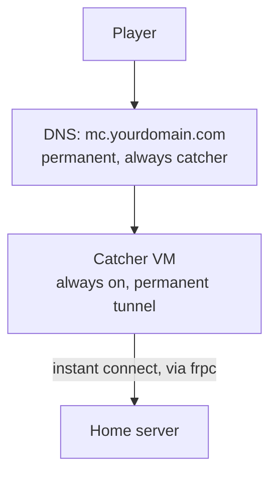

# mc-serverless-proxy

A reference architecture for exposing a self-hosted Minecraft server publicly through
a stable address, from behind CGNAT. Built and battle-tested on a real home server.
One always-on VM ("catcher"), no scale-to-zero component, no second region to manage.

## The problem this solves

You're self-hosting Minecraft at home, behind CGNAT (no public IP of your own,
whatever your ISP hands you can change at any time). You want a stable public
address that's always reachable, so DNS never has to change and players never get
"unknown host."

This repo is the setup that does that: one small VM in the cloud (catcher) holds a
permanent tunnel to your home server and is the address players actually connect to.

## Architecture


```mermaid
flowchart TD
    Player[Player] --> DNS["DNS: mc.yourdomain.com<br/>permanent, always catcher"]
    DNS --> Catcher["Catcher VM<br/>always on, permanent tunnel"]
    Catcher -- "instant connect, via frpc" --> Home["Home server"]
```

- **Catcher**: a small always-on VM. Runs `frps` and holds a permanent tunnel
  straight to your home server. It's the one thing that's always reachable, and the
  only thing DNS ever points at.
- **Home server**: your actual Minecraft server, running `frpc` to dial out to
  catcher (so nothing has to punch through your CGNAT from the outside in).

## Getting the idle cost to (almost) $0

An always-on VM sounds like it should already be free if you stay in a provider's
free tier. On GCP it isn't, quite: since GCP's Feb 2024 pricing change, **every
external IPv4 address in use by a running VM bills separately**, about $0.005/hour,
whether it's static or ephemeral, and that charge was never part of the Always Free
line items. A fully free-tier-eligible catcher VM on GCP still costs roughly
$3.65/month just for its own address.

**Don't try to dodge this with a load balancer.** GCP has a separate, longstanding
exemption: a static IP assigned to a **load balancer forwarding rule** isn't
charged, only IPs attached directly to a VM's network interface are.
`catcher/setup-load-balancer.ts` (still in this repo, not used by default) does
exactly that: moves catcher's address off the VM and onto a passthrough Network
Load Balancer forwarding rule pointed at the same VM. It works, and it does not
save money: confirmed live 2026-08-17 against a real GCP bill, the forwarding
rule's own per-hour minimum charge (roughly $20/month for one region's TCP+UDP
rules) is *higher* than the ~$3.65/month per-VM-IP charge it's dodging. Use a plain
static IP directly on the VM instead. The script and this section are kept for
reference in case GCP's pricing changes again.

**Oracle Cloud's Always Free tier currently avoids this charge entirely.** Unlike
GCP (and AWS), Oracle does not appear to bill separately for a running instance's
public IP, so the whole per-VM-IP cost above simply doesn't apply there. See
`considerations.md` for the full cost investigation and the current live setup
(catcher now runs on Oracle's Always Free x86 shape in Singapore, steady-state cost
close to $0/month).

**Other things worth checking if your bill isn't near zero**: an unattached leftover
disk from an old experiment (`gcloud compute disks list`, look for empty `users`); a
reserved-but-unattached static IP left over from testing (`gcloud compute addresses
list`, `STATUS: RESERVED` instead of `IN_USE` bills at a *higher* rate than one
that's actually in use); and an orphaned load balancer from an abandoned experiment
(`gcloud compute forwarding-rules list` across every region you've touched). All
three are easy to create by accident while iterating on this setup and all are
silent, ongoing charges until deleted. The load balancer case is the most expensive
of the three by far: confirmed live 2026-08-17, an abandoned forwarding rule (plus
its backend service, instance group, and health check) left behind from testing
cost more per month than every other resource in the entire project combined.
Deleting a forwarding rule alone isn't enough, it depends on a backend service,
which depends on an instance group and a health check; all four have to go
(`gcloud compute forwarding-rules delete`, then `backend-services delete`, then
`instance-groups unmanaged delete` and `health-checks delete`, in that order, each
one fails while something still depends on it).

**Alternatives considered, for context**: AWS Lightsail's cheapest IPv4-capable plan
is a flat $5/month, more than this setup costs on GCP even before the load balancer
mistake above. Cloudflare Spectrum needs at least a Pro plan (~$20/month) to proxy
arbitrary TCP. Fly.io dropped its free tier in 2024. None of these change the
fundamentals of the architecture, only where catcher physically runs.

## Bedrock/mobile cross-play, and frp's broken UDP proxy

Adding Bedrock (mobile, console) support means [GeyserMC](https://geysermc.org)
(translates Bedrock's RakNet/UDP protocol to Java on the fly) +
[Floodgate](https://github.com/GeyserMC/Floodgate) (lets Bedrock players skip
Java/Microsoft account auth) + [ViaVersion](https://github.com/ViaVersion/ViaVersion)
(lets one pinned server version accept clients on other versions). AuthMe works fine
alongside all of this; LibreLogin (a candidate auth-plugin replacement with native
Floodgate support) does not, its bundled PacketEvents dependency crashes on
ViaVersion-translated CONFIGURATION-phase packets whenever a client's version
differs from the server's pinned version, a real, still-open upstream bug
([retrooper/packetevents#895](https://github.com/retrooper/packetevents/issues/895)),
not a config mistake, confirmed by reproducing the identical failure with two
independent RakNet clients (a hand-rolled one and PrismarineJS's `bedrock-protocol`).

**frp's `type = "udp"` proxy doesn't work for this.** It relays replies from a
dynamically allocated port instead of the port the request arrived on, which breaks
NAT traversal for real clients, most home/mobile routers only accept a reply from
the exact address:port they sent their request to. Confirmed live: the reply
genuinely left catcher with the correct payload, just from the wrong source port,
and it never reached a real client.

An earlier fix (`catcher/udp_relay_catcher.ts` + `home-server/udp_relay_home.ts`,
both deleted 2026-08-20) wrapped raw UDP frames inside a private protocol carried
over a plain frp **TCP** proxy. That worked, but TCP forces in-order delivery, which
head-of-line-blocks RakNet/Bedrock traffic on any dropped packet, exactly the
retransmission cost UDP is supposed to avoid for a loss-tolerant protocol. Replaced
with a real WireGuard tunnel between catcher and home plus a kernel DNAT rule
forwarding public UDP 19132 straight through to home over the tunnel, genuine UDP
end to end, no TCP anywhere in the path. See `considerations.md`'s "Bedrock UDP
head-of-line-blocking tradeoff fixed" section for the setup and gotchas.

**`--can-ip-forward` on GCP was a load-balancer-specific requirement, not a general
one, and is no longer needed by the setup this README currently recommends.** It
mattered only because GCP's anti-spoofing filter drops any packet whose source
doesn't match the VM's own primary IP, and a reply sent through a load balancer's
IP looks exactly like that. Catcher dropped the load balancer entirely on
2026-08-17 (the per-forwarding-rule minimum charge made it cost more than the
plain-IP charge it was avoiding, see "Getting the idle cost to (almost) $0" above),
and a plain 1:1 NAT setup has no such IP mismatch to trigger anti-spoofing on in the
first place. Confirmed empirically on 2026-08-19 migrating catcher to Oracle Cloud
(which has no equivalent setting at all): real Bedrock RakNet ping/pong worked with
a stock instance, nothing analogous to `--can-ip-forward` configured. If you're
running catcher behind a load balancer for some other reason, this still applies to
you; the default path in this README no longer needs it.

## PROXY protocol / real client IP

If you put anything in front of `frps` that terminates the connection (a load
balancer, a reverse proxy), the client's real source IP gets replaced with the
proxy's own. `frps`/`frpc` support the PROXY protocol (`transport.proxyProtocolVersion`
in the relevant `[[proxies]]` block) to carry the original address through instead,
which matters if your home server does any IP-based logging, rate limiting, or
banning. A plain 1:1 NAT static IP directly on the VM (the setup this README
recommends) doesn't need this at all, since nothing terminates the connection
before it reaches `frps`; it only becomes relevant again if you put catcher behind
a load balancer, which is not the default path anymore.

## Layout

- `catcher/`: the always-on entry point, `frps`, and `setup-load-balancer.ts` (not
  used by default, see "Getting the idle cost to (almost) $0"). Bedrock/UDP goes
  through a WireGuard tunnel + DNAT set up directly on the box, not any file here,
  see `considerations.md`.
- `home-server/`: runs on your actual Minecraft box, `frpc` dialing catcher.
- `terraform/` and `scripts/provision.ts`: two equivalent ways to provision the
  catcher VM and its reserved static IP, pick one, they create the same resources.
- `scripts/provision_oracle_catcher.sh` and `scripts/try_create_oracle_catcher.sh`:
  the Oracle Cloud Always Free setup catcher currently runs on, see
  `considerations.md` for the full story.

## Setup

Every script here is TypeScript, run directly by [Bun](https://bun.sh) (`curl -fsSL
https://bun.sh/install | bash`), no build step, no `node_modules`. Install Bun on
both machines (catcher, home server) before anything else.

1. Provision a catcher VM (`e2-micro` is plenty) with a reserved static IP. Two
   ways to do this on GCP:

   **Terraform** (`terraform/`, provider `hashicorp/google`): creates the VM, the
   firewall rules, and the reserved static IP.

   ```bash
   cd terraform
   terraform init
   terraform apply -var="project_id=your-project-id"
   ```

   **Bun script** (`scripts/provision.ts`), a runnable equivalent of the raw
   `gcloud` block below if you'd rather not copy/paste commands or use Terraform:

   ```bash
   PROJECT=your-project-id bun run scripts/provision.ts
   ```

   **Raw `gcloud`**, if you'd rather not use Terraform or the Bun script:

   ```bash
   PROJECT="your-project-id"
   CATCHER_ZONE="us-west1-a" # Always Free eligible: us-west1/us-central1/us-east1

   gcloud config set project "$PROJECT"
   gcloud services enable compute.googleapis.com

   gcloud compute firewall-rules create allow-minecraft \
     --network=default --direction=INGRESS --action=ALLOW \
     --rules=tcp:25565 --source-ranges=0.0.0.0/0
   gcloud compute firewall-rules create allow-frp-control \
     --network=default --direction=INGRESS --action=ALLOW \
     --rules=tcp:7000 --source-ranges=0.0.0.0/0
   # Bedrock/mobile cross-play, see "Bedrock/mobile cross-play" below. Only needed if
   # you're setting that up; harmless to leave in otherwise.
   gcloud compute firewall-rules create allow-minecraft-bedrock \
     --network=default --direction=INGRESS --action=ALLOW \
     --rules=udp:19132 --source-ranges=0.0.0.0/0
   gcloud compute firewall-rules create allow-ssh \
     --network=default --direction=INGRESS --action=ALLOW \
     --rules=tcp:22 --source-ranges=0.0.0.0/0

   # Reserve catcher's IP as its own resource before the VM exists, so it survives
   # the VM being recreated later.
   gcloud compute addresses create mc-catcher-ip --region="${CATCHER_ZONE%-*}"

   gcloud compute instances create mc-catcher-vm \
     --zone="$CATCHER_ZONE" --machine-type=e2-micro \
     --image-family=debian-12 --image-project=debian-cloud \
     --address=mc-catcher-ip --scopes=compute-rw --tags=mc-catcher
   ```

   Or, for genuinely $0/month steady-state cost, use Oracle Cloud's Always Free
   tier instead of GCP: see `considerations.md` for the reasoning and
   `scripts/provision_oracle_catcher.sh` for the setup script.

2. Install `frp` on both machines (catcher, home server). Generate one shared auth
   token, put it in every `frps.toml`/`frpc-catcher.toml` here (replace
   `REPLACE_ME`), and don't commit it.
3. Deploy each directory's scripts and systemd units to their respective machine,
   replacing every `YOUR_*`/`YOURDOMAIN` placeholder with your actual values. Each
   `.ts` file has a `#!/usr/bin/env bun` shebang and should be `chmod +x`'d, systemd
   invokes them directly, the same way it would a shell script.
4. Create one permanent A record pointing at catcher's static IP. It never
   changes, so no DNS credentials are needed anywhere in this setup at runtime.
5. That's it, catcher keeps its own static IP directly on the VM (a plain 1:1 NAT),
   no load balancer needed. Do **not** run `catcher/setup-load-balancer.ts`: it
   moves catcher's IP onto a load balancer forwarding rule, which costs more per
   month than the per-VM-IP charge it's trying to avoid (see "Getting the idle cost
   to (almost) $0" above). It's kept in the repo only for reference in case GCP's
   pricing changes again.

## License

MIT, see `LICENSE`.
